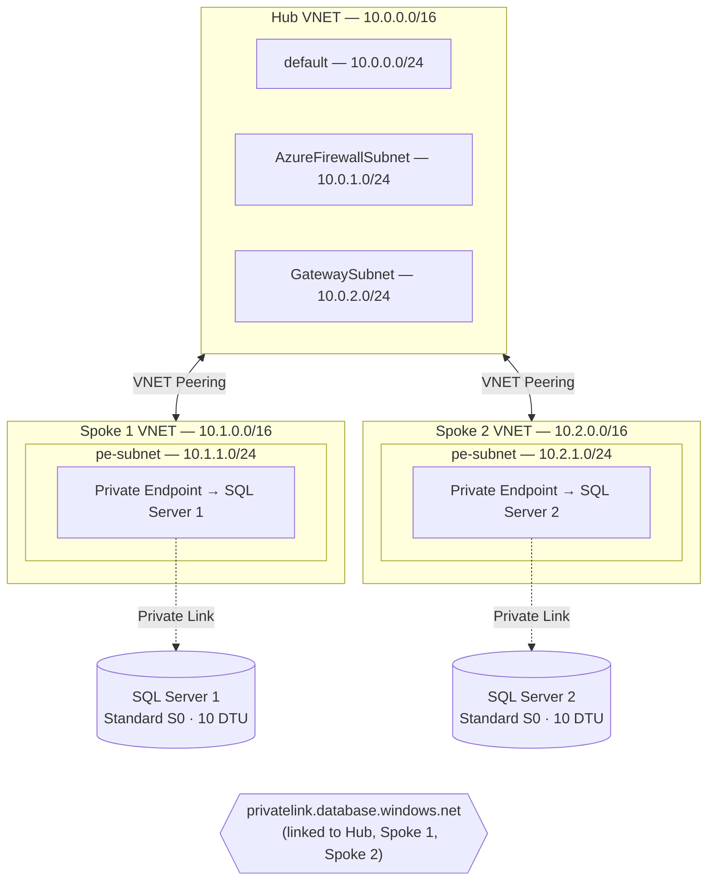

# Azure Hub-Spoke VNET Topology with SQL Private Endpoints

Deploy a hub-spoke virtual network topology on Azure with two Azure SQL Servers connected via Private Link — each isolated in its own spoke VNET. All infrastructure is defined in modular **Bicep** templates.

---

## Architecture



---

## Key Design Decisions

| Decision | Detail |
|---|---|
| **Public access disabled** | SQL Server 1 (querying side) rejects public connections; access is exclusively via private endpoints. |
| **Allow Azure Services on SQL Server 2** | SQL Server 2 (remote/target) must have **Allow Azure services and resources to access this server** enabled. Elastic query connections originate from the Azure SQL service infrastructure, not from your VNET, so private endpoints alone are insufficient. Service tags and VNET rules are also not supported for this traffic. See [Microsoft documentation](https://learn.microsoft.com/azure/azure-sql/database/elastic-query-overview?view=azuresql#connectivity-requirements). |
| **Private DNS zone** | A single `privatelink.database.windows.net` zone is linked to all three VNETs, ensuring consistent name resolution across the topology. |
| **Hub-ready subnets** | The hub VNET includes `AzureFirewallSubnet` and `GatewaySubnet` placeholders for future NVA or VPN/ExpressRoute gateway deployment. |
| **Private endpoint policies** | `privateEndpointNetworkPolicies` is set to `Disabled` on PE subnets to permit private endpoint creation. |
| **Modular Bicep** | Each resource type is a standalone module for reuse and testability. |

---

## Project Structure

```
infra/
├── main.bicep                  # Orchestration template
├── main.parameters.json        # Parameter values
├── deploy.sh                   # Deployment script
└── modules/
    ├── vnet.bicep              # Virtual network (hub & spokes)
    ├── vnetPeering.bicep       # VNET peering
    ├── sqlServer.bicep         # SQL Server + database
    ├── privateEndpoint.bicep   # Private endpoint + DNS zone group
    └── privateDnsZone.bicep    # Private DNS zone + VNET links
sql/
├── 01-setup-remote-db2.sql     # Create sample table + login on DB2
├── 02-setup-elastic-query-db1.sql  # External data source + table on DB1
├── 03-verify-elastic-query.sql # Test queries across databases
└── 04-cleanup.sql              # Tear down elastic query objects
```

---

## Prerequisites

- [Azure CLI](https://learn.microsoft.com/cli/azure/install-azure-cli) v2.50+
- [Bicep CLI](https://learn.microsoft.com/azure/azure-resource-manager/bicep/install) (bundled with Azure CLI)
- An active Azure subscription with Contributor access

---

## Deployment

### 1. Clone the repository

```bash
git clone https://github.com/mhaywardhill/sql-database-elastic-query.git
cd sql-database-elastic-query
```

### 2. Set environment variables

All deployment parameters are configured via `export`. Set the following before running the deploy script:

```bash
export RESOURCE_GROUP="rg-sql-elastic-query"
export LOCATION="uksouth"
export PROJECT_PREFIX="eqry"
export SQL_ADMIN_LOGIN="sqladmin"
export SQL_ADMIN_PASSWORD="YourStr0ngP@ssword!"
```

> **Note:** If `SQL_ADMIN_PASSWORD` is not set, the deploy script will prompt for it securely at runtime.

| Variable | Default | Description |
|---|---|---|
| `RESOURCE_GROUP` | `rg-sql-elastic-query` | Target resource group name |
| `LOCATION` | `uksouth` | Azure region |
| `PROJECT_PREFIX` | `eqry` | Prefix used for all resource names |
| `SQL_ADMIN_LOGIN` | `sqladmin` | SQL Server administrator login |
| `SQL_ADMIN_PASSWORD` | *(prompted)* | SQL Server administrator password |

### 3. Deploy

```bash
./infra/deploy.sh
```

---

## Elastic Query Setup

After deploying the infrastructure, configure [elastic query](https://learn.microsoft.com/azure/azure-sql/database/elastic-query-overview) to query data on **DB2** from **DB1** using an external table.

### How it works

```
┌──────────────┐   external table   ┌──────────────┐
│    DB1       │ ──────────────────► │    DB2       │
│  (Spoke 1)   │   via Private Link │  (Spoke 2)   │
│              │                    │              │
│ RemoteCustomers ─── maps to ───── │ Customers    │
└──────────────┘                    └──────────────┘
```

### Step 1 — Set up the remote database (DB2)

Connect to the **master** database on SQL Server 2 and then to **eqry-db2**. Run:

```bash
sqlcmd -S <sql-server-2-fqdn>.database.windows.net -U sqladmin -P '<password>' -d eqry-db2 -i sql/01-setup-remote-db2.sql
```

This script:
- Creates a login and user for elastic query authentication
- Creates a sample `Customers` table with 5 rows
- Grants `SELECT` permission to the elastic query user

> **Note:** The `CREATE LOGIN` statement must be run against the **master** database. Run it separately if using `sqlcmd`.

### Step 2 — Set up the elastic query (DB1)

Before running, edit `sql/02-setup-elastic-query-db1.sql` and replace:
- `<MasterKeyP@ssword2>` — a master key password for DB1
- `<ElasticQueryP@ssword1>` — the password used in step 1 for the elastic query login
- `<sql-server-2-fqdn>` — the FQDN of SQL Server 2 (from deployment outputs)

Then run:

```bash
sqlcmd -S <sql-server-1-fqdn>.database.windows.net -U sqladmin -P '<password>' -d eqry-db1 -i sql/02-setup-elastic-query-db1.sql
```

This script:
- Creates a database master key
- Creates a database-scoped credential
- Creates an external data source pointing to DB2
- Creates an external table `dbo.RemoteCustomers` mapped to `dbo.Customers` on DB2

### Step 3 — Verify

Run the verification queries on DB1:

```bash
sqlcmd -S <sql-server-1-fqdn>.database.windows.net -U sqladmin -P '<password>' -d eqry-db1 -i sql/03-verify-elastic-query.sql
```

You should see the Customers data from DB2 returned as if it were a local table.

### Cleanup

To remove elastic query objects without deleting the infrastructure:

```bash
sqlcmd -S <sql-server-1-fqdn>.database.windows.net -U sqladmin -P '<password>' -d eqry-db1 -i sql/04-cleanup.sql
```

---

## Resources Deployed

| Resource | Purpose |
|---|---|
| 3 × Virtual Network | Hub + 2 spokes |
| 4 × VNET Peering | Bidirectional hub ↔ spoke1, hub ↔ spoke2 |
| 2 × Azure SQL Server | Logical SQL servers with public access disabled |
| 2 × SQL Database | Standard S0 (10 DTU) databases |
| 1 × Private DNS Zone | `privatelink.database.windows.net` linked to all VNETs |
| 2 × Private Endpoint | One per SQL Server, placed in each spoke's `pe-subnet` |

---

## Clean Up

```bash
az group delete --name rg-sql-elastic-query --yes --no-wait
```

---

## License

This project is licensed under the terms of the [MIT License](LICENSE).