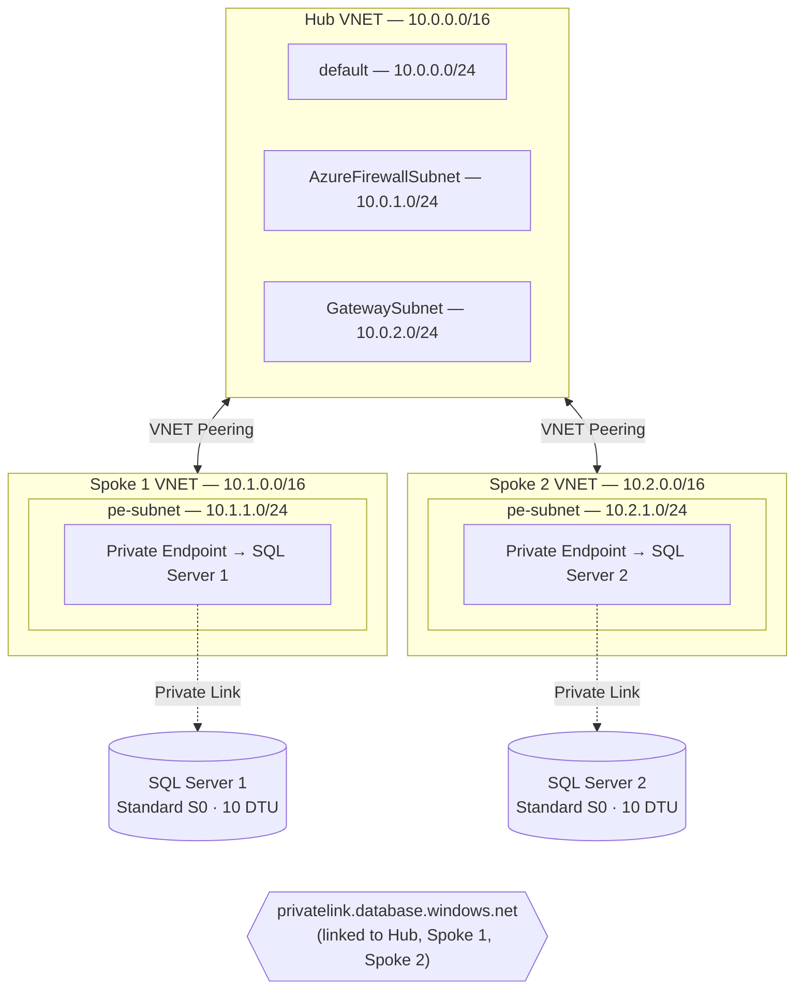

# Azure Hub-Spoke VNET Topology with SQL Private Endpoints

Deploy a hub-spoke virtual network topology on Azure with two Azure SQL Servers connected via Private Link — each isolated in its own spoke VNET. All infrastructure is defined in modular **Bicep** templates.

---

## Architecture



---

## Key Design Decisions

| Decision | Detail |
|---|---|
| **Public access disabled** | Both SQL Servers reject public connections; access is exclusively via private endpoints. |
| **Private DNS zone** | A single `privatelink.database.windows.net` zone is linked to all three VNETs, ensuring consistent name resolution across the topology. |
| **Hub-ready subnets** | The hub VNET includes `AzureFirewallSubnet` and `GatewaySubnet` placeholders for future NVA or VPN/ExpressRoute gateway deployment. |
| **Private endpoint policies** | `privateEndpointNetworkPolicies` is set to `Disabled` on PE subnets to permit private endpoint creation. |
| **Modular Bicep** | Each resource type is a standalone module for reuse and testability. |

---

## Project Structure

```
infra/
├── main.bicep                  # Orchestration template
├── main.parameters.json        # Parameter values
├── deploy.sh                   # Deployment script
└── modules/
    ├── vnet.bicep              # Virtual network (hub & spokes)
    ├── vnetPeering.bicep       # VNET peering
    ├── sqlServer.bicep          # SQL Server + database
    ├── privateEndpoint.bicep    # Private endpoint + DNS zone group
    └── privateDnsZone.bicep     # Private DNS zone + VNET links
```

---

## Prerequisites

- [Azure CLI](https://learn.microsoft.com/cli/azure/install-azure-cli) v2.50+
- [Bicep CLI](https://learn.microsoft.com/azure/azure-resource-manager/bicep/install) (bundled with Azure CLI)
- An active Azure subscription with Contributor access

---

## Deployment

### 1. Clone the repository

```bash
git clone https://github.com/mhaywardhill/sql-database-elastic-query.git
cd sql-database-elastic-query
```

### 2. Set environment variables

All deployment parameters are configured via `export`. Set the following before running the deploy script:

```bash
export RESOURCE_GROUP="rg-sql-elastic-query"
export LOCATION="uksouth"
export PROJECT_PREFIX="eqry"
export SQL_ADMIN_LOGIN="sqladmin"
export SQL_ADMIN_PASSWORD="YourStr0ngP@ssword!"
```

> **Note:** If `SQL_ADMIN_PASSWORD` is not set, the deploy script will prompt for it securely at runtime.

| Variable | Default | Description |
|---|---|---|
| `RESOURCE_GROUP` | `rg-sql-elastic-query` | Target resource group name |
| `LOCATION` | `uksouth` | Azure region |
| `PROJECT_PREFIX` | `eqry` | Prefix used for all resource names |
| `SQL_ADMIN_LOGIN` | `sqladmin` | SQL Server administrator login |
| `SQL_ADMIN_PASSWORD` | *(prompted)* | SQL Server administrator password |

### 3. Deploy

```bash
./infra/deploy.sh
```

---

## Resources Deployed

| Resource | Purpose |
|---|---|
| 3 × Virtual Network | Hub + 2 spokes |
| 4 × VNET Peering | Bidirectional hub ↔ spoke1, hub ↔ spoke2 |
| 2 × Azure SQL Server | Logical SQL servers with public access disabled |
| 2 × SQL Database | Standard S0 (10 DTU) databases |
| 1 × Private DNS Zone | `privatelink.database.windows.net` linked to all VNETs |
| 2 × Private Endpoint | One per SQL Server, placed in each spoke's `pe-subnet` |

---

## Clean Up

```bash
az group delete --name rg-sql-elastic-query --yes --no-wait
```

---

## License

This project is licensed under the terms of the [MIT License](LICENSE).